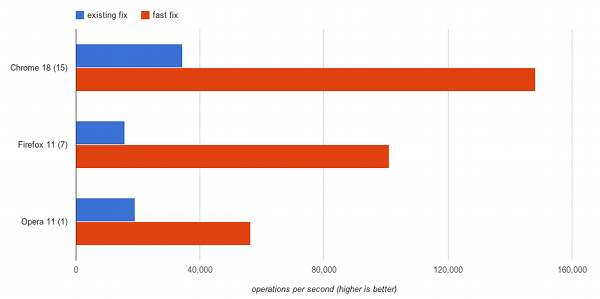

# Hi, I'm jQuery++.

I am a MIT licensed collection of extremely useful DOM helpers and special events for jQuery 1.7 and
later. I'm not a UI project like [jQuery UI](http://jqueryui.com/) or 
[jQuery Tools](http://jquerytools.org/). Instead, I'm all about providing
low-level utilities for things that jQuery doesn't support.  If [Underscore](http://underscorejs.org/)
is jQuery's functional-programming tie, I am jQuery's bald-spot covering toupee.

Select the plugins you want and click "Download" for a customized, unminified JavaScript file:



Learn more about [how I](#why_jquery__) can be useful to you. If you think I should
have other utilities, lets me know on the [forum](https://forum.javascriptmvc.com/#Forum/jquery). And,
if you like me, check out my sister library [CanJS](http://canjs.us). Finally, my apologies 
about talking about myself in the third person from this point forward.

## Get jQuery++

There are several ways to get and setup jQuery++:

 - using the download builder
 - using individual files
 - using Steal
 - using AMD

### Using the download builder

Simply select the files you want and click "Download". This will create and download a `jquerypp.custom.js`
with all the files you selected and their dependencies. Load this script
after jQuery 1.7 like:





### Using individual files

The `jquerypp.js` file from the [full download](https://github.com/downloads/jupiterjs/jquerypp/jquerypp-{{page.version}}.zip)
contains all jQuery++ plugins in a single file:





The `lib` folder contains each plugin as a separate file. There is a list of dependencies that need to be included first
at the top of each file. For example, `jquery.animate.js` depends on `jquery.styles.js` so it needs to be loaded like this:





### Using Steal

The files needed for using jQuery++ with [StealJS](http://javascriptmvc.com/docs.html#!stealjs) are
located in the `steal/` folder of
the [full download](https://github.com/downloads/jupiterjs/jquerypp/jquerypp-{{page.version}}.zip).
Take the `jquery/` folder and put it in your steal root to load a plugin like this:


steal('jquery/dom/dimensions', 'jquery/event/resize', function() {
  $('#element').outerWidth(500).resize();
});


Make sure to use `steal.map`  to map any dependency of `jquery` to your jQuery library, if necessary. For example, when
using jQuery++ with [CanJS](http://canjs.us) and Steal:


steal.map({
  "jquery/jquery.js" : "can/util/jquery/jquery.1.7.1.js"
});


### Using AMD

The files to load the jQuery++ plugins with an [AMD](https://github.com/amdjs/amdjs-api/wiki/AMD) module loader like [RequireJS](http://requirejs.org/), are located in the `amd/` folder of the [full download](https://github.com/downloads/jupiterjs/jquerypp/jquerypp-{{page.version}}.zip).
Place the `jquerypp/` folder in your module directory and load a plugin like this:


define(['jquery', 'jquerypp/dimensions', 'jquerypp/event/resize'],
  function($) {
    $('#element').outerWidth(500).resize();
});


You might have to map the `jquery` module name to the name of your jQuery AMD module. In RequireJS like this:


require.config({
  paths: {
    "jquery": "./jquery-1.7.2"
  }
});


> Note: Starting at version 1.7 jQuery will define itself as an AMD module if a loader is available. There is no need to create a wrapper anymore.

## DOM HELPERS

## animate `$(el).animate(properties, [speed], [callback]) -> jQuery`

[Annotated source](http://donejs.com/jquery/docs/jquery.animate.html)

[jQuery.animate](http://donejs.com/docs.html#!jQuery.animate) overwrites `$.fn.animate` to use
CSS 3 animations if possible.
It takes the same arguments as the original [$.fn.animate](http://api.jquery.com/animate) and will fall back to
jQuery's JavaScript animation if a CSS animation is not possible.

A fade-in effect can be implemented like this:


$('#element').css({
  opacity : 0
}).animate({
  opacity : 1
}, 1000, function() {
  console.log('Animation done');
});


Since CSS transitions are implemented natively in the browser and can make use of hardware acceleration, animations will perform a lot better, especially in Webkit based mobile browsers (iPhone, iPad, Android).

## compare `$(elA).compare(elB) -> Number`

[Annotated source](http://donejs.com/jquery/docs/jquery.compare.html)

[jQuery.compare](http://donejs.com/docs.html#!jQuery.compare) adds `$.fn.compare` to compare the position of two nodes. It returns a number that represents a bitmask showing how they are positioned relative to each other. The following list shows the `bitmask`, the __number__ and what it means for a `$.fn.compare` call like `$('#foo').compare($('#bar'))`:

* `000000` -> __0__: Elements are identical
* `000001` -> __1__: The nodes are in different documents (or one is outside of a document)
* `000010` -> __2__: #bar precedes #foo
* `000100` -> __4__: #foo precedes #bar
* `001000` -> __8__: #bar contains #foo
* `010000` -> __16__: #foo contains #bar

You can tell if `#foo` precedes `#bar` like:


if( $('#foo').compare($('#bar')) & 4 ) {
  console.log("#foo preceds #bar");
}


This is useful to rapidly compare element positions which is common when widgets can reorder themselves (drag-drop) or with nested widgets (trees). In the following example, select two elements to see how they compare to each other and what bitmask the result represents:

<iframe style="width: 100%; height: 520px" src="http://jsfiddle.net/n5b5q/embedded/result,html,js,css" allowfullscreen="allowfullscreen" frameborder="0">JSFiddle</iframe>

## cookie `$.cookie(name, [value], [options]) -> Object|String`

[Annotated source](http://donejs.com/jquery/docs/jquery.cookie.html)

[jQuery.cookie](http://donejs.com/docs.html#!jQuery.cookie) packages Klaus Hartl's [jQuery cookie](https://github.com/carhartl/jquery-cookie) plugin for manipulating cookies. Use it like:


// Set a session cookie
$.cookie('the_cookie', 'the_value');
$.cookie('the_cookie'); // -> 'the_value'
// Set a cookie that expires in 7 days
$.cookie('the_cookie', 'the_value', { expires: 7 });
// delete the cookie
$.cookie('the_cookie', null);


The following *options* are available:

* `expires` - the expiration time in days or an expiry date
* `domain` - the domain name
* `path` - the value of the path for the cookie
* `secure` - if the cookie requires HTTPS

The example uses `jQuery.cookie` and [formParams](#formParams) to persist a form to a cookie. You can save the form
 or load it from the value stored in the cookie. At the bottom it shows the current cookie value after running it through
 `decodeURIComponent`:

<iframe style="width: 100%; height: 300px" src="http://jsfiddle.net/wMN7G/embedded/result,html,js,css" allowfullscreen="allowfullscreen" frameborder="0">JSFiddle</iframe>

## dimensions

[Annotated source](http://donejs.com/jquery/docs/jquery.dimensions.html)

[jQuery.dimensions](http://donejs.com/docs.html#!jQuery.dimensions) overwrites `$.fn.innerWidth`, `$.fn.outerWidth`, `$.fn.innerHeight`, `$.fn.outerHeight` and enables `$.fn.animate` to animate these values. Inner dimensions include the padding where outer dimensions also take care of borders and margins (if *includeMargin* is set to `true`). Set and read these values using:

* `$(el).innerHeight([height])`
* `$(el).outerHeight([height], [includeMargin])`
* `$(el).innerWidth([width])`
* `$(el).outerWidth([width], [includeMargin])`

And use `$(el).animate({ innerHeight : 100 })` to animate them. This is useful when you care about animating/setting the visual dimension of an element (which is what you typically want to do):


$('#foo').outerWidth(100).innerHeight(50);
$('#bar').animate({ outerWidth: 500 });


The following example lets you change the different width properties used by `$(el).innerWidth([width])` and
`$(el).outerWidth([width], [includeMargin])` like margin, padding and border and shows how it influences the other
 values:

<iframe style="width: 100%; height: 500px" src="http://jsfiddle.net/5ZbSH/embedded/result,html,js,css" allowfullscreen="allowfullscreen" frameborder="0">JSFiddle</iframe>

## fills `$(element).fills([parent]) -> jQuery`

[Annotated source](http://donejs.com/jquery/docs/jquery.fills.html)

[jQuery.fills](http://donejs.com/docs.html#!jQuery.fills) adds `$.fn.fills` to make an element fill out a parent element.
It takes care of any padding, margins and dimensions of other sibling elements and will update the dimensions when the parent
[resizes](#resize). You can either pass a parent selector or jQuery element or an object with the following options:

- __parent__ - The parent element selector or jQuery element
- __className__ - The class name to add to the element. Not set by default
- __all__ - Restore the parent element to its original size first

`jQuery.fills` is extremely useful for complex layouts especially since it also takes care of elements that wrap automatically.
Resize the container in the following example using the blue square to see how the `#fill` element adjusts its size correctly
to fill out the remaining space:

<iframe style="width: 100%; height: 350px" src="http://jsfiddle.net/HSWTA/embedded/result,html,js,css" allowfullscreen="allowfullscreen" frameborder="0">JSFiddle</iframe>

## formParams `$(form).formParams([convert]) -> Object|jQuery`

[Annotated source](http://donejs.com/jquery/docs/jquery.form_params.html)

[jQuery.formParams](http://donejs.com/docs.html#!jQuery.formParams) adds `$.fn.formParams` which serializes a form into a JavaScript object. It creates nested objects by using bracket notation in the form element name. If *convert* is `true`, values that look like numbers or booleans will be converted and empty strings won't be added to the object. For a form like this:


<form>
  <input type="text" name="first" value="John" />
  <input type="text" name="last" value="Doe" />
  <input type="text" name="phone[mobile]" value="1234567890" />
  <input type="text" name="phone[home]" value="0987654321" />
</form>


`$.fn.formParams` returns:


$('form').formParams()
// -> {
//   first : "John", last : "Doe",
//   phone : { mobile : "1234567890", home : "0987654321" }
// }


It is also possible to set form values by passing an object:


$('form').formParams({
  first : 'Mike',
  last : 'Smith'
});


Update the form in the following example to see a JSON representation of the object returned by `$.fn.formParams`:

<iframe style="width: 100%; height: 300px" src="http://jsfiddle.net/xJLvn/embedded/result,html,js,css" allowfullscreen="allowfullscreen" frameborder="0">JSFiddle</iframe>

## range `$.Range([el]) -> range` `$(el).range() -> range`

[Annotated source](http://donejs.com/jquery/docs/jquery.range.html)

Use [jQuery.Range](http://donejs.com/docs.html#!jQuery.Range) to create, move and compare text ranges. Use `$.Range.current()` to get the currently selected text range. `$(el).range()` returns a text range on an element.

For example, for an element like `
This is some text
`, `$.Range` can be used like this:


// Get a text range for #text
var range = $('#text').range();
// Move the start 5 characters to the right
range.start('+5');
// Move the end 5 characters to the left
range.end('-5');
// Return the range text
range.toString(); // is some
// Select the current range
range.select();


A `$.Range` instance offers the following methods:

<ul>
  <li><a href="http://donejs.com/docs.html#!jQuery.Range.prototype.clone" class="code">range.clone() -> range</a>
  - clones the range and returns a new $.Range object
  </li>
  <li><a href="http://donejs.com/docs.html#!jQuery.Range.prototype.collapse" class="code">range.collapse([toStart]) -> range</a> collapses a range
  </li>
  <li><a href="http://donejs.com/docs.html#!jQuery.Range.prototype.compare" class="code">range.compare(type, other) -> Number</a>
  - compares one range to another range
  </li>
  <li><a href="http://donejs.com/docs.html#!jQuery.Range.prototype.end" class="code">range.end([val]) -> range|Object</a>
  - sets or returns the end of the range
  </li>
  <li><a href="http://donejs.com/docs.html#!jQuery.Range.prototype.move" class="code">range.move(type, referenceRange) -> range</a>
  - move the endpoints of a range relative to another range
  </li>
  <li><a href="http://donejs.com/docs.html#!jQuery.Range.prototype.overlaps" class="code">range.overlaps(other) -> Boolean</a>
  - returns if any portion of these two ranges overlap
  </li>
  <li><a href="http://donejs.com/docs.html#!jQuery.Range.prototype.parent" class="code">range.parent() -> HtmlElement|Element|Node</a>
  - returns the most common ancestor element of the endpoints in the range
  </li>
  <li><a href="http://donejs.com/docs.html#!jQuery.Range.prototype.rect" class="code">range.rect(from) -> TextRectangle</a>
  - returns the bounding rectangle of this range
  </li>
  <li><a href="http://donejs.com/docs.html#!jQuery.Range.prototype.rects" class="code">range.rects(from) -> Array</a>
  - returns the client rects
  </li>
  <li><a href="http://donejs.com/docs.html#!jQuery.Range.prototype.start" class="code">range.start([val]) -> range|Object</a>
  - sets or returns the beginning of the range
  </li>
  <li><a href="http://donejs.com/docs.html#!jQuery.Range.prototype.start" class="code">range.toString() -> String</a>
  - returns the text of the range
  </li>
</ul>

The following example uses `jQuery.range` to

- Show the start end end offset of the selection
- Show the selected plain text
- Add a green border on the left to the start element
- Add a red border on the right to the end element
- Put a dotted outline around the parent element

<iframe style="width: 100%; height: 300px" src="http://jsfiddle.net/vKSzN/embedded/result,html,js,css" allowfullscreen="allowfullscreen" frameborder="0">JSFiddle</iframe>

## selection `$(el).selection([start], [end]) -> Object|jQuery`

[Annotated source](http://donejs.com/jquery/docs/jquery.selection.html)

[jQuery.selection](http://donejs.com/docs.html#!jQuery.selection) adds `$.fn.selection` to set or retrieve the currently selected text range. It works on all elements:



This is some text




// Make a selection in #text from position eight to 12
$('#text').selection(8, 12);
var selection = $('#text').selection();
// -> { start : 8, end : 12 }
$('#text').text().substring(selection.start, selection.end) // -> some


The following example shows how `$.fn.selection` can be used. Initially the selection is set from position eight to 12. You can change the selection in the highlighted area and the status text will be updated:

<iframe style="width: 100%; height: 200px" src="http://jsfiddle.net/uze4F/embedded/result,html,js,css" allowfullscreen="allowfullscreen" frameborder="0">JSFiddle</iframe>

## styles `$(el).styles() -> Object`

[Annotated source](http://donejs.com/jquery/docs/jquery.styles.html)

[jQuery.styles](http://donejs.com/docs.html#!jQuery.styles) adds `$.fn.styles` as a fast way of getting a set of computed styles from an element. It performs much faster than retrieving them individually e.g. by using [jQuery.css()](http://api.jquery.com/css/). Computed styles reflect the actual current style of an element, including browser defaults and CSS settings.


$("#foo").styles('float','display')
// -> { cssFloat: "left", display: "block" }


The following example implements a `fastHeight` jQuery plugin which uses `$.fn.styles` to calculate the element height and compares
the runtime to the equivalent [jQuery.height](http://api.jquery.com/height/):

<iframe style="width: 100%; height: 250px" src="http://jsfiddle.net/6CcaG/embedded/result,html,js,css" allowfullscreen="allowfullscreen" frameborder="0">JSFiddle</iframe>

## within `$(el).within(left, top, [useOffsetCache]) -> jQuery`

[Annotated source](http://donejs.com/jquery/docs/jquery.within.html)

[jQuery.within](http://donejs.com/docs.html#!jQuery.within) adds `$.fn.within` and `$.fn.withinBox` that return all elements having a given position or area in common. The following example returns all `div` elements having the point 200px left and 200px from the top in common:


$('div').within(200, 200)


Use `$(el).withinBox(left, top, width, height)` to get all elements within a certain area:


$('*').withinBox(200, 200, 100, 100)


Move the mouse in the following example and it will show the ids for `div` elements within the current mouse position:

<iframe style="width: 100%; height: 330px" src="http://jsfiddle.net/akSQD/embedded/result,html,js,css" allowfullscreen="allowfullscreen" frameborder="0">JSFiddle</iframe>

> [jQuery.event.drag](http://donejs.com/docs.html#!jQuery.event.drag) uses *jQuery.within* to determine dropable elements at the current position.

## EVENTS

## destroyed `destroyed`

[Annotated source](http://donejs.com/jquery/docs/jquery.event.destroyed.html)

The `destroyed` event is triggered by [jQuery.event.destroyed](http://donejs.com/docs.html#!jQuery.event.destroyed) when the element is removed from the DOM using one of the jQuery [manipulation methods](http://api.jquery.com/category/manipulation/).


$('form').on('destroyed', function() {
  // Clean up when a form element has been removed
});


*Note: The destroyed event does not bubble.*

## drag `dragdown` `draginit` `dragmove` `dragend` `dragover` `dragout`

[Annotated source](http://donejs.com/jquery/docs/jquery.event.drag.html)

[jQuery.event.drag](http://donejs.com/docs.html#!jQuery.event.drag) adds *delegatable* drag events to jQuery:

* `dragdown` - the mouse cursor is pressed down
* `draginit` - the drag motion is started
* `dragmove` - the drag is moved
* `dragend` - the drag has ended
* `dragover` - the drag is over a drop point
* `dragout` - the drag moved out of a drop point

An element will become draggable by attaching an event listener for one of these events on it. A simple slider can be implemented like this:


$('#dragger').on('draginit', function(ev, drag) {
  drag.limit($(this).parent());
  drag.horizontal();
});


Which looks like this in action:

<iframe style="width: 100%; height: 200px" src="http://jsfiddle.net/T5K3j/embedded/result,html,js,css" allowfullscreen="allowfullscreen" frameborder="0">JSFiddle</iframe>

The `drag` object (passed to the event handler as the second parameter) can be used to modify the drag behavior:

<ul>
  <li><a href="http://donejs.com/docs.html#!jQuery.Drag.prototype.cancel" class="code">drag.cancel() -> undefined</a>
  - stops the drag motion from happening
  </li>
  <li><a href="http://donejs.com/docs.html#!jQuery.Drag.prototype.ghost" class="code">drag.ghost() -> jQuery</a>
  - copys the draggable and drags the cloned element
  </li>
  <li><a href="http://donejs.com/docs.html#!jQuery.Drag.prototype.horizontal" class="code">drag.horizontal() -> drag</a>
  - limits the scroll to horizontal movement
  </li>
  <li><a href="http://donejs.com/docs.html#!jQuery.Drag.prototype.only" class="code">drag.only([only]) -> Boolean</a>
  - only have drags, no drops
  </li>
  <li><a href="http://donejs.com/docs.html#!jQuery.Drag.prototype.representative" class="code">drag.representative(element, offsetX, offsetY)</a> - move another element in place of this element
  </li>
  <li><a href="http://donejs.com/docs.html#!jQuery.Drag.prototype.revert" class="code">drag.revert(val) -> drag</a>
  - animate the drag back to its position
  </li>
  <li><a href="http://donejs.com/docs.html#!jQuery.Drag.prototype.step" class="code">drag.step(pixels) -> drag</a>
  - makes the drag move in steps of amount pixels
  </li>
  <li><a href="http://donejs.com/docs.html#!jQuery.Drag.prototype.vertical" class="code">drag.vertical() -> drag</a>
  - limit the drag to vertical movement
  </li>
  <li><a href="http://donejs.com/docs.html#!jQuery.Drag.prototype.limit" class="code">drag.limit(container, center) -> drag</a>
  - limit the drag within an element
  </li>
  <li><a href="http://donejs.com/docs.html#!jQuery.Drag.prototype.scrolls" class="code">drag.scrolls(elements, options) -> undefined</a>
  - scroll scrollable areas when dragging near their boundaries
  </li>
</ul>

## drop `dropinit` `dropover` `dropout` `dropmove` `dropon` `dropend`

[Annotated source](http://donejs.com/jquery/docs/jquery.event.drop.html)

[jQuery.event.drop](http://donejs.com/docs.html#!jQuery.event.drop) complements `jQuery.event.drag` with *delegatable* drop events:

* `dropinit` - the drag motion is started, drop positions are calculated
* `dropover` - a drag moves over a drop element, called once as the drop is dragged over the element
* `dropout` - a drag moves out of the drop element
* `dropmove` - a drag is moved over a drop element, called repeatedly as the element is moved
* `dropon` - a drag is released over a drop element
* `dropend` - the drag motion has completed

The following example adds the `highlight` class when a drag is moved over the element and removes it when it leaves:


$('.drop').on({
  "dropover" : function(ev, drop, drag){
    $(this).addClass('highlight');
  },
  "dropout" : function(ev, drop, drag){
    $(this).removeClass('highlight');
  }
});


The `drop` object offers the following methods:

<ul>
  <li><a href="http://donejs.com/docs.html#!jQuery.Drop.prototype.cancel" class="code">drop.cancel() -> undefined</a>
  - prevents this drop from being dropped on
  </li>
  <li><a href="http://donejs.com/docs.html#!jQuery.Drop.prototype.cache" class="code">drop.cache() -> undefined</a>
  - call on <code>dropinit</code> to cache the position of draggable elements
  </li>
</ul>

When adding drop-able elements after `dropinit`, for example when expanding a folder view after hovering over it with a draggable for a while, <a href="http://donejs.com/docs.html#!jQuery.Drop.static.compile" class="code">$.Drop.compile()</a> needs to be called explicitly to update the list of dropable elements (this happens automatically on `dropinit`).

The following example shows two draggable elements and a drop area. When a drag starts it will create a copy of the element using `drag.ghost()`. The drop area will be highlighted when the drag moves over it and update the text when it is dropped:

<iframe style="width: 100%; height: 250px" src="http://jsfiddle.net/3NkZM/embedded/result,html,js,css" allowfullscreen="allowfullscreen" frameborder="0">JSFiddle</iframe>

## fastfix

[Annotated source](http://donejs.com/jquery/docs/jquery.event.fastfix.html)

[jQuery.event.fastfix](http://donejs.com/docs.html#!jQuery.event.fastfix) speeds up `jQuery.event.fix` by using ECMAScript 5
getters. `jQuery.event.fix` is used to normalize a DOM event before it gets passed as a
[jQuery.Event](http://api.jquery.com/category/events/event-object/) instance to event handlers. This is usually done by
*copying* the properties from the DOM event. `jQuery.event.fastfix` uses ES 5 getters to access these properties
only when they are needed.

Since `jQuery.event.fix` usually takes up a major portion of an applications runtime, using `jQuery.event.fastfix`
can significantly improve overall performance - just by including this plugin. The following chart [compares the
performance](http://jsperf.com/jquery-event-fix/6) of the original `jQuery.event.fix` and `jQuery.event.fastfix` in major browsers:

## hover `hoverinit` `hoverenter` `hovermove` `hoverleave`

[Annotated source](http://donejs.com/jquery/docs/jquery.event.hover.html)

[jQuery.event.hover](http://donejs.com/docs.html#!jQuery.event.hover) provides the following hover events:

* `hoverinit` - called on mouseenter
* `hoverenter` - an element is being hovered
* `hovermove` - the mouse moves on an element that has been hovered
* `hoverleave` - the mouse leaves the hovered element


$('li.menu').on({
  hoverenter : function(){
    $(this).addClass("hovering");
  },
  hoverleave : function(){
    $(this).removeClass("hovering");
  }
});


An element is hovered when the mouse moves less than a certain distance in a specific time over the element. These values can be modified either globally by setting `$.Hover.delay` and `$.Hover.distance` or individually during `hoverinit`:


$(".option").on("hoverinit", function(ev, hover){
  //set the distance to 10px
  hover.distance(10);
  //set the delay to 200ms
  hover.delay(200);
})


You can also set `hover.leave(time)` to set a time that the hover should stay active for after the mouse left.
The following example shows `jQuery.event.hover` with different settings for distance, delay and leave:

<iframe style="width: 100%; height: 300px" src="http://jsfiddle.net/uGUju/embedded/result,html,js,css" allowfullscreen="allowfullscreen" frameborder="0">JSFiddle</iframe>

## key `event.keyName()`

[Annotated source](http://donejs.com/jquery/docs/jquery.event.key.html)

[jQuery.event.key](http://donejs.com/docs.html#!jQuery.event.key) adds a `.keyName()` method to the event object that returns a string representation of the current key:


$("input").on('keypress', function(ev){
  // Don't allow backspace keys
  if(ev.keyName() == '\b') {
    ev.preventDefault();
  }
  if(ev.keyName() == 'f1') {
    alert('I could be a tooltip for help');
  }
});


The following key names are mapped by default:

* `\b` - backspace
* `\t` - tab
* `\r` - enter key
* `shift`, `ctrl`, `alt`
* `pause-break`, `caps`, `escape`, `num-lock`, `scroll-loc`, `print`
* `page-up`, `page-down`, `end`, `home`, `left`, `up`, `right`, `down`, `insert`, `delete`
* `' '` - space
* `0-9` - number key pressed
* `a-z` - alpha key pressed
* `num0-9` - number pad key pressed
* `f1-12` - function keys pressed
* Symbols: `/`, `;`, `:`, `=`, `,`, `-`, `.`, `/`, `[`, `\`, `]`, `'`, `"`

The following example shows the keyname for `keydown`, `keyup` and `keypress` events on the input field:

<iframe style="width: 100%; height: 230px" src="http://jsfiddle.net/9eE7D/embedded/result,html,js,css" allowfullscreen="allowfullscreen" frameborder="0">JSFiddle</iframe>

## pause

[jQuery.event.pause](http://donejs.com/docs.html#!jQuery.event.pause) adds a default event handler, `event.pause()` and `event.resume()` for pausing and resuming event propagation and `$.fn.triggerAsync` for triggering an event asynchronously and executing a callback when propagation is finished.

This is very useful for creating event oriented jQuery widgets that provide default behavior for certain events.
A widget user can intercept any of these events, pause it and perform other actions before resuming the default
action or prevent it entirely.

### Example

The following example implements a `tabs` widget using [CanJS](http://canjs.us). Each tab panel contains a form to input data. When the form data changes and you go to another tab it will ask you to save these changes before moving on. This will pause the tabs `hide` event until you either confirmed or declined to save the form. On *cancel* the event will be prevented and the widget will stay in the current tab:

<iframe style="width: 100%; height: 350px" src="http://jsfiddle.net/4Bg3Z/embedded/result,html,js,css" allowfullscreen="allowfullscreen" frameborder="0">JSFiddle</iframe>

### triggerAsync `$(el).triggerAsync(event, [success], [prevented])`

[Annotated source](http://donejs.com/jquery/docs/jquery.event.default.html)

[jQuery.fn.triggerAsync](http://donejs.com/docs.html#!jQuery.fn.triggerAsync) triggers an event and calls a *success* handler when it has finished propagating through the DOM and no handler called `event.preventDefault()` or returned `false`. The *prevented* callback will be used otherwise:


$('panel').triggerAsync('show', function(){
    $('#panel').show();
  },function(){
    $('#other').addClass('error');
});


### default events `eventname.default`

[Annotated source](http://donejs.com/jquery/docs/jquery.event.default.html)

[jQuery.event.default](http://donejs.com/docs.html#!jQuery.event.default) adds default event handlers. A default event runs when all other event handlers have been triggered and none has called `event.preventDefault()` or returned `false`. Default events are prefixed with the `default` namespace. The following example adds a default `toggle` event:


$('#text').on('toggle.default', function(ev) {
    $(this).toggle();
});

$('#text').on('toggle', function(ev, animation) {
    if(animation) {
        $(this).toggle(animation);
        ev.preventDefault();
    }
});


### pause and resume `event.pause()` `event.resume()`

[Annotated source](http://donejs.com/jquery/docs/jquery.event.pause.html)

Pausing an event works similar to [.stopImmediatePropagation()](http://api.jquery.com/event.stopImmediatePropagation/) by calling `event.pause()`. Calling `event.resume()` will continue propagation. This is great when doing asynchronous processing in an event handler:


$('#todos').on('show', function(ev){
  ev.pause();

  $(this).load('todos.html', function(){
    ev.resume();
  });
});


## resize `resize`

[Annotated source](http://donejs.com/jquery/docs/jquery.event.resize.html)

[jQuery.event.resize](http://donejs.com/docs.html#!jQuery.event.resize) allows you to listen to `resize` events on arbitrary elements. Unlike other events that bubble from the target element to the document the `resize` event will propagate from the outside-in.
This means that outside elements will always resize first. Trigger the `resize` event whenever the dimensions of an element change and inside elements should adjust as well.

The following example will always resize to it's full parent width and height


$('#foo').on('resize', function() {
  var parent = $(this).parent();
  $(this).width(parent.width()).height(parent.height());
})

$(document.body).resize();


The `resize` event makes creating application like layouts a lot easier. The following example creates a common layout with top, left, right and center elements within a container. Use the blue square to resize the outside container. The `resize` event will take care of adjusting the dimensions of the inside elements accordingly using the [jQuery.dimensions](#dimensions) plugin:

<iframe style="width: 100%; height: 350px" src="http://jsfiddle.net/3dRGM/embedded/result,html,js,css" allowfullscreen="allowfullscreen" frameborder="0">JSFiddle</iframe>

## swipe `swipeleft` `swiperight` `swipeup` `swipedown` `swipe`

[Annotated source](http://donejs.com/jquery/docs/jquery.event.swipe.html)

[jQuery.event.swipe](http://donejs.com/docs.html#!jQuery.event.swipe) adds support for swipe motions providing the *delegatable* `swipeleft`, `swiperight`, `swipedown`, `swipeup` and `swipe` events:


$('#swiper').on({
  'swipe' : function(ev) {
    console.log('Swiping');
  },
  'swipeleft' : function(ev) {
    console.log('Swiping left');
  },
  'swiperight' : function(ev) {
    console.log('Swiping right');
  },
  'swipeup' : function(ev) {
    console.log('Swiping up');
  },
  'swipedown' : function(ev) {
    console.log('Swiping down');
  }
});


Set `jQuery.event.swipe.delay` to the maximum time the swipe motion is allowed to take (default is 500ms).

Swipe (using the mouse) in the green area in the following example to see the direction of the swipe:

<iframe style="width: 100%; height: 300px" src="http://jsfiddle.net/abaZN/embedded/result,html,js,css" allowfullscreen="allowfullscreen" frameborder="0">JSFiddle</iframe>

## Get Help

This site highlights the most important features of jQuery++. You can find the full API documentation on the
[DoneJS documentation](http://donejs.com/docs.html#!jquerypp) page.

There are also several places you can go to ask questions or get help debugging problems.

### Twitter

Follow [@jquerypp](http://twitter.com/#!/jquerypp) for updates, announcements and quick answers to your questions.

### Forums

Visit the [Forums](http://forum.javascriptmvc.com/#Forum/jquerypp) for questions requiring more than 140 characters. DoneJS has a thriving community that's always eager to help out.

### IRC

The DoneJS IRC channel (`#donejs` on **irc.freenode.net**) is an awesome place to hang out with fellow DoneJS users and get your questions answered quickly.

__Help Us Help You __

Help the community help you by using the [jQuery++ jsFiddle template](http://jsfiddle.net/donejs/ZLvA5/). Just fork it and include the URL when you are asking for help.

### Get Help from Bitovi

Bitovi _(developers of jQuery++)_ offers [training](http://bitovi.com/training/) and [consulting](http://bitovi.com/consulting/) for your team. They can also provide private one-on-one support staffed by their JavaScript/Ajax experts. [Contact Bitovi](mailto:contact@bitovi.com) if you're interested.

## Why jQuery++

### Easy to use

jQuery++ does things the jQuery way, which makes it really easy to learn if you are already familiar with jQuery.
Get functionality that was always tricky to implement from one coherent library:

- Set and animte outer and inner dimensions with [dimensions](#dimensions)
- Serialize forms into objects with [formParams](#formparams)
- [Drag](#drag) & [drop](#drop) events - no need for jQuery UI
- [Resize](#resize) elements the right way
- Listen to [swipe events](#swipe) for mobile apps
- [Pause and resume](#pause) events for event oriented JavaScript applications

### Flexible

You don't have to use all of jQuery++. Just chose the plugins you want using the [download builder](#get_jquery__-download_builder),
load them with [StealJS](#get_jquery__-using_steal) or as [AMD modules](#get_jquery__-using_amd).
Each plugin only includes the dependencies it actually needs, so your JavaScript application will stay as small as possible.

Delegatable events also make it easy to integrate with libraries like [CanJS](http://canjs.us) and
[Backbone](http://documentcloud.github.com/backbone/). No custom APIs to take care of, just the jQuery
way of handling events.

### Fast

Some jQuery++ plugins can help to significantly speed up your applications. Use

- [styles](#styles) to get computed style from an element a lot faster
- [compare](#compare) to quickly compare element positions
- [fastfix](#fastfix) to speed up jQuery's event handling on modern browsers
- [destroyed](#destroyed) to avoid memory leaks and keep your references up to date when elements get removed from the DOM

### Supported

jQuery++ is developed by [Bitovi](http://bitovi.com). We're active on the forums, but should the need
arise, can also be hired for paid support, training, and development.

## Developing jQuery++

To develop jQuery++, add features, etc, you first must install DoneJS. DoneJS is the
parent project of jQuery++ and the 4.0 version of JavaSciptMVC. It has DocumentJS and
Steal as submodules that are used to generate the documentation and build the jQuery++ downloads.

### Installing

 1. Clone DoneJS with:

        git clone git://github.com/jupiterjs/donejs

 2. Install all submodules by running

        cd donejs
        git submodule update --init --recursive

    Depending on your version of git, you might need to cd into each submodule and run `git checkout`.

 3. Fork [jquerypp](https://github.com/jupiterjs/jquerypp) on Github

 4. Add your own fork as a remote in the `jquery` submodule:

        cd jquery
        git checkout master
        git remote add fork git@github.com:<username>/jquerypp.git

### Developing

After [installing](#developing_jquery__-installing) jQuery++ and DoneJS, you'll find
the jQuery++ files in the `jquery` folder. Within `jquery`, the plugins are located in the `dom` and `event` folders.
The `controller`, `model`, `class` and `view` folder are currently kept for backwards compatibility with JavaScriptMVC 3.2/3.3 and shouldn't be modified.
For each plugin (for example `jquery/dom/compare`) you will find:

- `compare.html` - A demo page
- `compare.js` - The actual commented and uncompressed source code
- `compare.md` - The overview page (used in the generated documentation)
- `compare_test.js` - The plugin tests
- `qunit.html/funcunit.html` - The unit and/or functional tests

To develop jQuery++:

 1. Edit the _plugin's_ file.
 2. Add tests to the _plugin\_test.js_ test file.
 3. Open the plugin test page `qunit.html` or `funcunit.html` and make sure everything passes
 4. Open the big test page in `jquery/qunit.html` and make sure all tests pass
 5. Commit your changes and push to your fork (`git push fork <branch>`)
 5. Submit a pull request!

### Documentation

To edit jquerypp.com, installing jQuery++ and DoneJS is not necessary. Simply *fork* and edit the
github pages's [index.md page](https://github.com/jupiterjs/jquerypp/blob/gh-pages/index.md) online. Don't forget to
submit a pull request.

To edit the documentation at [DoneJS.com](http://doneJS.com/docs.html):

 1. [install](#developing_jquery__-installing) jQuery++ and DoneJS.
 2. Edit the markdown and js files in the `jquery` folder.
 3. In the `donejs` root folder generate the docs with:

        ./js site/scripts/doc.js

    View them at `site/docs.html`

 4. Submit a pull request.

### Making a build

To make a jQuery++ build, run:

    js jquery/build/make.js

It puts the downloads in `jquery/dist`. To build a specific version check out the [git tag](https://github.com/jupiterjs/jquerypp/tags)
you want to build and run the above command.

### List of heroes

The following lists everyone who's contributed something to CanJS.  If we've forgotten you, please add yourself.

First, thanks to everyone who's contributed to [JavaScriptMVC](https://github.com/jupiterjs/javascriptmvc/contributors)
and [jQueryMX](https://github.com/jupiterjs/jquerymx/contributors), and the people at
[Bitovi](http://bitovi.com/people/). This page is for contributors after jQuery++'s launch:

[callumacrae](https://github.com/callumacrae) - [Width property for jQuery.selection](https://github.com/jupiterjs/jquerypp/pull/11) and documentation fixes.
[fabianonunes](https://github.com/fabianonunes) - Fixed several errors in the build process.

### Change Log

__1.0 Beta 2__

- feature: [Key mapping tool for jQuery.event.key for international characters](https://github.com/jupiterjs/jquerypp/issues/16)
- fix: [jQuery.formParams converts disabled fields](https://github.com/jupiterjs/jquerypp/issues/24)
- fix: [jQuery.animate supports all parameters](https://github.com/jupiterjs/jquerypp/issues/22)
- change: [jQuery.event.drag supports touch events](https://github.com/jupiterjs/jquerypp/issues/23)
- feature: [Added jQuery.fills](#fills)
- fix: [jQuery.animate .stop() doesn't work](https://github.com/jupiterjs/jquerypp/issues/19)
- fix: [Bug with duplicate sub keys](https://github.com/jupiterjs/jquerypp/issues/17)
- change: [Added width property to jQuery.selection](https://github.com/jupiterjs/jquerypp/pull/11)
- fix: [Security error in jQuery.animate](https://github.com/jupiterjs/jquerypp/issues/5)
- *jquerypp.com*
  - jsFiddle examples for [cookie](#cookie), [compare](#compare), [range](#range), [styles](#styles) and [key](#key)
  - Links to annotated sources ([e.g. jQuery.animate](http://donejs.com/jquery/docs/jquery.animate.html))
  - Changelog and list of heroes section

__1.0 Beta__ (June 1st 2012)

- Released!