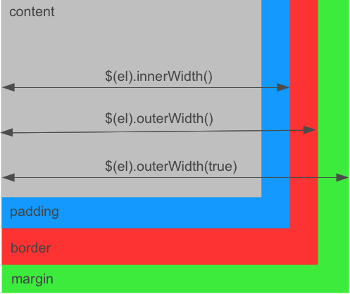

# Welcome to jQuery++

jQuery++ is a collection of useful jQuery extensions and events.

They are organized in two broad categories:

 - DOM Helpers - helpers to work with DOM function or improve jQuery performance
 - Events - jQuery special events

## Get jQuery++

### Download Builder

Check the files you want to download and a zip file will be created. The zip file will contain each individual plugin, and a combined version of all plugins minified and unminified.

### Using Steal

Add these to your jQuery folder:

### Using AMD

require('jquery/compare')

## DOM HELPERS

## compare `$(elA).compare(elB) -> Number`

[jQuery.compare](http://donejs.com/docs.html#!jQuery.compare) adds `$.fn.compare` to compare the position of two nodes. It returns a number that represents a bitmask showing how they are positioned relative to each other. The following list shows the `bitmask`, the __number__ and what it means for a `$.fn.compare` call like `$('#foo').compare($('#bar'))`:

* `000000` -> __0__: Elements are identical
* `000001` -> __1__: The nodes are in different documents (or one is outside of a document)
* `000010` -> __2__: #bar precedes #foo
* `000100` -> __4__: #foo precedes #bar
* `001000` -> __8__: #bar contains #foo
* `010000` -> __16__: #foo contains #bar

You can tell if `#foo` precedes `#bar` like:


if( $('#foo').compare($('#bar')) & 4 ) {
  console.log("#foo preceds #bar");
}


This is useful to rapidly compare element positions which is common when widgets can reorder themselves (drag-drop) or with nested widgets (trees).

## cookie `$.cookie(name, [value], [options]) -> Object|String`

[jQuery.cookie](http://donejs.com/docs.html#!jQuery.cookie) packages Klaus Hartl's [jQuery cookie](https://github.com/carhartl/jquery-cookie) plugin for manipulating cookies. Use it like:


// Set a session cookie
$.cookie('the_cookie', 'the_value');
$.cookie('the_cookie') // -> 'the_value'
// Set a cookie that expires in 7 days
$.cookie('the_cookie', 'the_value', { expires: 7 });
// delete the cookie
$.cookie('the_cookie', null);


The following *options* are available:

* `expires` - the expiration time in days or an expiry date
* `domain` - the domain name
* `path` - the value of the path for the cookie
* `secure` - if the cookie requires HTTPS

## dimensions

[jQuery.dimensions](http://donejs.com/docs.html#!jQuery.dimensions) overwrites `$.fn.innerWidth`, `$.fn.outerWidth`, `$.fn.innerHeight`, `$.fn.outerHeight` and enables `$.fn.animate` to animate these values. Inner dimensions include the padding where outer dimensions also take care of borders and margins (if *includeMargin* is set to `true`). Set and read these values using:

* `$(el).innerHeight([height])`
* `$(el).outerHeight([height], [includeMargin])`
* `$(el).innerWidth([width])`
* `$(el).outerWidth([width], [includeMargin])`

And use `$(el).animate({ innerHeight : 100 })` to animate them. This is useful when you care about animating/setting the visual dimension of an element (which is what you typically want to do):


$('#foo').outerWidth(100).innerHeight(50);
$('#bar').animate({outerWidth: 500});


The following graphic shows which dimensions are included for  `$(el).width()`, `$(el).innerWidth()` and `$(el).outerWidth()`:

## formParams `$(form).formParams([convert]) -> Object|jQuery`

[$.formParams](http://donejs.com/docs.html#!jQuery.formParams) adds `$.fn.formParams` which serializes a form into a JavaScript object. It creates nested objects by using bracket notation in the form element name. If *convert* is `true`, values that look like numbers or booleans will be converted and empty strings won't be added to the object. For a form like this:


<form>
  <input type="text" name="first" value="John" />
  <input type="text" name="last" value="Doe" />
  <input type="text" name="phone[mobile]" value="1234567890" />
  <input type="text" name="phone[home]" value="0987654321" />
</form>


`$.fn.formParams` returns:


$('form').formParams()
// -> {
//   first : "John", last : "Doe",
//   phone : { mobile : "1234567890", home : "0987654321" }
// }


It is also possible to set form values:


$('form').formParams({
  first : 'Mike',
  last : 'Smith'
});


## range `$.Range([el]) -> range` `$(el).range() -> range`

[jQuery.Range](http://donejs.com/docs.html#!jQuery.Range) helps creating, moving and comparing text ranges. Use `$.Range().current()` to get the currently selected text range or the jQuery plugin `$(el).range()` to get a `$.Range` instance from an element. For example, assuming that in a div like `
This is some text
` the text from position eight to 12 is currently selected, `$.Range` can be used like this:


var range = $.Range.current();
// Returns the currently selected text
range.toString() // -> some
// Get the beginning of the range
range.start() // -> { offset : 8, container : TextNode }
// Get the end of the range
range.end() // -> { offset : 12, container : TextNode }
// Get the selections common parent
range.parent() // -> TextNode
// Set the range start offset to 4
range.start(4);


The container returned by `start()` and `end()` can be of [type](https://developer.mozilla.org/en/nodeType) `Node.TEXT_NODE` or `Node.CDATA_SECTION_NODE`. To acces the element containing the text use this:


var startNode = range.start().container;
if( startNode.nodeType === Node.TEXT_NODE ||
    startNode.nodeType === Node.CDATA_SECTION_NODE ) {
  startNode = startNode.parentNode;
}
$(startNode).addClass('highlight');


A `$.Range` instance offers the following methods:

* `range.clone() -> range` - clones the range and returns a new $.Range object
* `range.collapse([toStart]) -> range` - clones the range and returns a new `$.Range` object
* `range.compare(other) -> Number` - compares one range to another range
* `range.end([val]) -> range|Object` - sets or returns the end of the range
* `range.move(type, referenceRange) -> range` - move the endpoints of a range relative to another range
* `range.overlaps(other) -> Boolean` - returns if any portion of these two ranges overlap
* `range.parent() -> HtmlElement|Element|Node` - returns the most common ancestor element of the endpoints in the range
* `range.rect(from) -> TextRectangle` - returns the bounding rectangle of this range
* `range.rects(from) -> undefined` - returns the client rects
* `range.start([val]) -> range|Object` - sets or returns the beginning of the range
* `range.toString() -> String` - returns the text of the range

## selection `$(el).selection([start], [end]) -> Object|jQuery`

[jQuery.selection](http://donejs.com/docs.html#!jQuery.selection) adds `$.fn.selection` to set or retrieve the currently selected text range. It works on all elements:



This is some text




// Make a selection in #text from position eight to 12
$('#text').selection(8, 12);
var selection = $('#text').selection();
// -> { start : 8, end : 12 }
$('#text').text().substring(selection.start, selection.end) // -> some


## styles `$(el).styles() -> Object`

[jQuery.styles](http://donejs.com/docs.html#!jQuery.styles) adds `$.fn.styles` as a fast way of getting a set of computed styles from an element. It performs a lot faster than retrieving them individually e.g. by using [jQuery.css()](http://api.jquery.com/css/). Computed styles reflect the actual current style of an element, including browser defaults and CSS settings.


$("#foo").styles('float','display')
// -> { cssFloat: "left", display: "block" }


## within `$(el).within(left, top, [useOffsetCache]) -> jQuery`

[jQuery.within](http://donejs.com/docs.html#!jQuery.within) adds `$.fn.within` and `$.fn.withinBox` that return all elements having a given position or area in common. The following example returns all `div` elements having the point 200px left and 200px from the top in common:


$('div').within(200, 200)


Use `$(el).withinBox(left, top, width, height)` to get all elements within a certain area:


$('*').withinBox(200, 200, 100, 100)


> [jQuery.event.drag](#drag) uses *$.within* to determine dropable elements at the current position.

## EVENTS

## destroyed `destroyed`

The `destroyed` event is triggered by [$.event.destroyed](http://donejs.com/docs.html#!jQuery.event.destroyed) when the element is removed from the DOM using one of the jQuery [manipulation methods](http://api.jquery.com/category/manipulation/).


$('form').on('destroyed', function() {
  // Clean up when a form element has been removed
});


*Note: The destroyed event does not bubble.*

## drag `dragdown` `draginit` `dragmove` `dragend` `dragover` `dragout`

[jQuery.event.drag](http://donejs.com/docs.html#!jQuery.event.drag) adds __delegatable__ drag events to jQuery:

* `dragdown` - the mouse cursor is pressed down
* `draginit` - the drag motion is started
* `dragmove` - the drag is moved
* `dragend` - the drag has ended
* `dragover` - the drag is over a drop point
* `dragout` - the drag moved out of a drop point

An element will become draggable by attaching an event listener for one of these events on it. A draggable div that can only be moved horizontally can be initialized like this:


$('div').on('draginit', function(event, drag) {
  drag.horizontal();
});


The `drag` object (passed to the event handler as the second parameter) can be used to modify the drag behavior:

* `drag.cancel()` - stops the drag motion from happening
* `drag.ghost() -> jQuery` - copys the draggable and drags the cloned element
* `drag.horizontal() -> Boolean` - limits the scroll to horizontal movement
* `drag.only([only]) -> Boolean` - only have drags, no drops
* `drag.representative(element, offsetX, offsetY)` - move another element in place of this element
* `drag.revert(val) -> drag` - animate the drag back to its position
* `drag.vertical()` - limit the drag to vertical movement
* `drag.limit(container, center) -> drag` - limit the drag within an element
* `drag.scrolls(elements, options)` - scroll scrollable areas when dragging near their boundaries

## drop `dropinit` `dropover` `dropout` `dropmove` `dropon` `dropend`

[$.event.drop](http://donejs.com/docs.html#!jQuery.event.drop) complements `jQuery.event.drag` with __delegatable__ drop events:

* `dropinit` - the drag motion is started, drop positions are calculated
* `dropover` - a drag moves over a drop element, called once as the drop is dragged over the element
* `dropout` - a drag moves out of the drop element
* `dropmove` - a drag is moved over a drop element, called repeatedly as the element is moved
* `dropon` - a drag is released over a drop element
* `dropend` - the drag motion has completed

The following example adds the `highlight` class when a drag is moved over the element and removes it when it leaves:


$('.drop').on({
  "dropover" : function(ev, drop, drag){
    $(this).addClass('highlight');
  },
  "dropout" : function(ev, drop, drag){
    $(this).removeClass('highlight');
  }
});


The `drop` object offers the following methods:

* `drop.cancel()`- prevents this drop from being dropped on
* `drop.cache()` - call on `dropinit` to cache the position of draggable elements
* `drop.compile()` - get all droppable elements and put them into a list. This will be called on `dropinit` by default. If new droppable elements are added after `dropinit`, compile has to be called explicitly.

## hover `hoverinit` `hoverenter` `hovermove` `hoverleave`

[jQuery.event.hover](http://donejs.com/docs.html#!jQuery.event.hover) is a flexible way to deal with the following hover related events:

* `hoverinit` - called on mouseenter
* `hoverenter` - an element is being hovered
* `hovermove` - the mouse moves on an element that has been hovered
* `hoverleave` - the mouse leaves the hovered element


$('li.menu').on({
  hoverenter : function(){
    $(this).addClass("hovering");
  },
  hoverleave : function(){
    $(this).removeClass("hovering");
  }
});


An element is hovered when the mouse moves less than a certain distance in a specific time over the element. These values can be modified either globally by setting `$.Hover.delay` and `$.Hover.distance` or individually during `hoverinit`:


$(".option").on("hoverinit", function(ev, hover){
  //set the distance to 10px
  hover.distance(10);
  //set the delay to 200ms
  hover.delay(200);
})


## key `event.keyName()`

[jQuery.event.key](http://donejs.com/docs.html#!jQuery.event.key) adds a `.keyName()` method to the event object that returns a string representation of the current key:


$("input").on('keypress', function(ev){
  // Don't allow backspace keys
  if(ev.keyName() == '\b') {
    ev.preventDefault();
  }
  if(ev.keyName() == 'f1') {
    alert('I could be a tooltip for help');
  }
});


The following key names are mapped by default:

* `\b` - backspace
* `\t` - tab
* `\r` - enter key
* `shift`, `ctrl`, `alt`
* `pause-break`, `caps`, `escape`, `num-lock`, `scroll-loc`, `print`
* `page-up`, `page-down`, `end`, `home`, `left`, `up`, `right`, `down`, `insert`, `delete`
* `' '` - space
* `0-9` - number key pressed
* `a-z` - alpha key pressed
* `num0-9` - number pad key pressed
* `f1-12` - function keys pressed
* Symbols: `/`, `;`, `:`, `=`, `,`, `-`, `.`, `/`, `[`, `\`, `]`, `'`, `"`

## pause

[$.event.pause](http://donejs.com/docs.html#!jQuery.event.pause) adds a default event handler, `event.pause()` and `event.resume()` for pausing and resuming event propagation and `$.fn.triggerAsync` for triggering an event asynchronously and executing a callback when propagation is finished.

### default events `eventname.default`

Allow you to add default event handlers. A default event runs when all other event handlers have been triggered and none has called `event.preventDefault()` or returned `false`. Default events are prefixed with the `default` namespace:


$("div").on("default.click", function(ev) {
  // ...
});


### triggerAsync `$(el).triggerAsync(event, [success], [prevented])`

[$.fn.triggerAsync](http://donejs.com/docs.html#!jQuery.fn.triggerAsync) triggers an event and calls a *success* handler when it has finished propagating through the DOM and no handler called `event.preventDefault()` or returned `false`. The *prevented* callback will be used otherwise:


$('panel').triggerAsync('show', function(){
    $('#panel').show();
  },function(){
    $('#other').addClass('error');
});


### pause and resume `event.pause()` `event.resume()`

Pausing an event works similar to [.stopImmediatePropagation()](http://api.jquery.com/event.stopImmediatePropagation/) by calling `event.pause()`. Calling `event.resume()` will continue propagation. This is great when doing asynchronous processing in an event handler:


$('#todos').on('show', function(ev){
  ev.pause();

  $(this).load('todos.html', function(){
    ev.resume();
  });
});


## resize `resize`

[$.event.resize](http://donejs.com/docs.html#!jQuery.event.resize) adds the `resize` event which is very useful for resizing a specific element whenever the parents dimension changes. Unlike other events that bubble from the target element to the document the `resize` event will propagate from the outside-in. This means that outside elements will always resize first.

	// TODO Descibe and link JS Fiddle example

<iframe style="width: 100%; height: 300px" src="http://jsfiddle.net/Daff/u7PpX/embedded/" allowfullscreen="allowfullscreen" frameborder="0">JSFiddle</iframe>

The following example will always resize to it's full parent width and height


$('#foo').on('resize', function(){
  var parent = $(this).parent();
  $(this).width(parent.width()).height(parent.height());
})

$(document.body).resize();


## swipe `swipeleft` `swiperight` `swipeup` `swipedown` `swipe`

[$.event.swipe](http://donejs.com/docs.html#!jQuery.event.swipe) adds support for swipe motions providing the `swipeleft`, `swiperight`, `swipedown`, `swipeup` and a general `swipe` event:


$('#swiper').on({
  'swipe' : function(ev) {
    console.log('Swiping');
  },
  'swipeleft' : function(ev) {
    console.log('Swiping left');
  },
  'swiperight' : function(ev) {
    console.log('Swiping right');
  },
  'swipeup' : function(ev) {
    console.log('Swiping up');
  },
  'swipedown' : function(ev) {
    console.log('Swiping down');
  }
});


Set `$.event.swipe.delay` to the maximum time the swipe motion is allowed to take (default is 500ms).

## Get Help

There are several places you can go to ask questions or get help debugging problems.

### Twitter

Follow [@donejs](https://twitter.com/#!/donejs) for updates, announcements and quick answers to your questions.

### Forums

Visit the [Forums](http://forum.javascriptmvc.com/#Forum/jquerypp) for questions requiring more than 140 characters. DoneJS has a thriving community that's always eager to help out.

### IRC

The DoneJS IRC channel (`#donejs` on **irc.freenode.net**) is an awesome place to hang out with fellow DoneJS users and get your questions answered quickly.

__Help Us Help You __

Help the community help you by using the [jQuery++ jsFiddle template](http://jsfiddle.net/donejs/qYdwR/) below. Just fork it and include the URL when you are asking for help.

### Get Help from Bitovi

Bitovi _(developers of jQuery++)_ offers [training](http://bitovi.com/training/) and [consulting](http://bitovi.com/consulting/) for your team. They can also provide private one-on-one support staffed by their JavaScript/Ajax experts. [Contact Bitovi](contact@bitovi.com) if you're interested.

## Why jQuery++

## Developing jQuery++

To develop jQuery++, add features, etc, you first must install DoneJS. DoneJS is the
parent project of jQuery++ and the 4.0 version of JavaSciptMVC. It has DocumentJS and
Steal as submodules that are used to generate the documentation and build the jQuery++ downloads.

### Installing

 1. `fork` [jquerypp on github](https://github.com/jupiterjs/jquerypp).
 2. Clone DoneJS with:

        git clone git@github.com:jupiterjs/donejs

 3. Open the donejs folder's .gitmodule file and change the URL of the `"jquery"` submodule:

        url = git://github.com/jupiterjs/jquerypp.git

    to your `fork`ed URL like

        url = git://github.com/justinbmeyer/jquerypp.git

 4. Install all submodules by running

        cd donejs
        git submodule update --init --recursive

    Depending on your version of git, you might need to cd into each submodule and run `git checkout`.

### Developing

After [installing](#developing_jquery__-installing) jQuery++ and DoneJS, you'll find
the jQuery++ files in the `jquery` folder. Within `jquery`, the plugins are located in the `dom` and `event` folders.
The `controller`, `model`, `class` and `view` folder are currently kept for backwards compatibility with JavaScriptMVC 3.2/3.3 and shouldn't be modified.
For each plugin (for example `jquery/dom/compare`) you will find:

- `compare.html` - A demo page
- `compare.js` - The actual commented and uncompressed source code
- `compare.md` - The overview page (used in the generated documentation)
- `compare_test.js` - The plugin tests
- `qunit.html/funcunit.html` - The unit and/or functional tests

To develop jQuery++:

 1. Edit the _plugin's_ file.
 2. Add tests to the _plugin\_test.js_ test file.
 3. Open the full test page in `jquery/qunit.html` and make sure your tests are included and everything still passes.
 4. Submit a pull request!

### Documentation

To edit jquerypp.com, installing jQuery++ and DoneJS is not necessary. Simply *fork* and edit the
github pages's [index.md page](https://github.com/jupiterjs/jquerypp/blob/gh-pages/index.md) online. Don't forget to
submit a pull request.

To edit the documentation at [DoneJS.com](http://doneJS.com/docs.html):

 1. [install](#developing_jquery__-installing) jQuery++ and DoneJS.
 2. Edit the markdown and js files in the `jquery` folder.
 3. Generate the docs with:

        js site/scripts/doc.js

    View them at `site/docs.html`

 4. Submit a pull request.

### Making a build

To make a jQuery++ build, run:

    js jquery/build/make.js

It puts the downloads in `jquery/dist`. To build a specific version check out the [git tag](https://github.com/jupiterjs/jquerypp/tags)
you want to build and run the above command.
